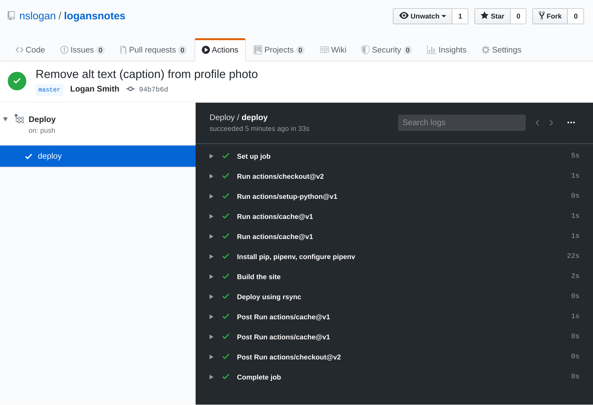
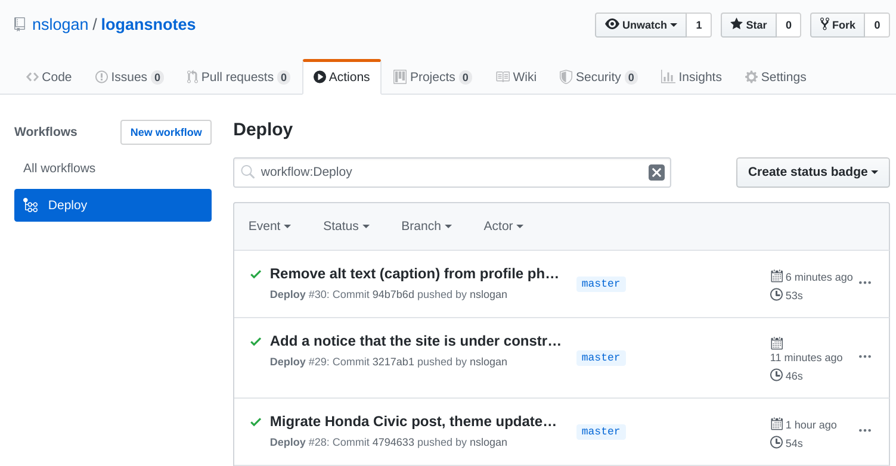

+++
title = "Automatic Site Deploy via GitHub Action"
date = 2020-05-07
+++

At both Impossible Aerospace and Open Lunar Foundation, one of the first devops projects I worked on was utilizing the source control infrastructure available from the respective provider (Atlassian and GitHub, respectively). A mantra I follow is "test early, test often" and the first step in testing is building. Having a pipeline setup that can even just build your code for every commit is a hugely valuable resource. It forces you to get a handle on the development environment necessary to build your code, a good step towards avoiding "it builds on my machine" problems.

I realized very quickly that having the ability to push to my master branch on GitHub and have the updates automatically deployed to my webserver would be fantastic. This also provided me an opportunity to start working with GitHub's workflow infrastructure, something I expect to be using more as I work on other projects. Most of my experience in devops has been with BitBucket's [Pipeline](https://bitbucket.org/product/features/pipelines) feature.

If you want to see the development process of my site workflow, browse the [Actions](https://github.com/nslogan/logansnotes/actions) page of my website's repo and look through the commits on the branch `feat/github-actions`. Below is a short summary of the development process.

## Development

### Building the Site

I started by reading lots of GitHub Actions [documentation](https://help.github.com/en/actions) and focused on just getting my Python environment working -- Python, pip, pipenv. The first workflow file that actually functioned and spit out something useful is below.

```yaml
name: Deploy

on:
  push:
    # All branches for now

jobs:
  build:
    runs-on: ubuntu-latest

    steps:
    - uses: actions/checkout@v2
    - uses: actions/setup-python@v1
      with:
        version: 3.6
    - name: Install pip, pipenv, dependencies
      run: |
        python -m pip install --upgrade pip
        pip install pipenv
        pipenv sync
    - name: Run a one-line script
      run: pipenv run pelican --version
```

Output for step "Run a one-line script":

```shell
pipenv run pelican --version
shell: /bin/bash -e {0}
env:
	pythonLocation: /opt/hostedtoolcache/Python/3.8.2/x64
4.2.0
```

However, this had an issue, which is evident in the shell output: `pythonLocation: /opt/hostedtoolcache/Python/3.8.2/x64`. I determined I was using the wrong argument for `actions/setup-python`, I should have used `python-version: 3.6`. I believe I carried that over from a different action example before I was using `actions/setup-python`.

Next I simply changed the line `pipenv run pelican --version` to `pipenv run pelican content -o site -s publishconf.py` to start building my site. This is the same command I run locally to build the production version of my site, only locally I use `make publish`. I opted against using the Makefile for now, even though that means my workflow isn't *identical* to my local process. Why? Because `make` isn't in the default image and I didn't feel like adding it as a dependency.

<!-- more -->

### Deploy the Site

Getting the site building was the easy part, especially with pipenv. Deploying the site was the trickier bit, mostly because I'm still very much a beginner at GitHub Actions. I started by adding [secrets](https://help.github.com/en/actions/configuring-and-managing-workflows/creating-and-storing-encrypted-secrets) to my repo for the SSH details (user, host, path). BitBucket, and basically all cloud source control providers, has the same concept of repository secrets which allow the user / team to store sensitive items, like SSH keys, access tokens, etc. in a repository for use in CI / CD / whatever use.

With the secrets installed, I then flailed against SSH and rsync for a bit. I started with `webfactory/ssh-agent` and directly calling `rsync` in a step. However, I never got a valid SSH connection, I kept getting `Host key verification failed`, indicating that something with SSH configuration clearly wasn't functioning. It's very likely I was doing something wrong; however, I didn't have the patience or interest in figuring out what it was -- somethings you have to know when to say "this isn't worth my time" and focus on the overall goal of your project.

So, I switched to `easingthemes/ssh-deploy` which worked immediately. Below is the new deploy step following the build step:

```yaml
- name: Deploy using rsync
  uses: easingthemes/ssh-deploy@v2.1.1
  env:
      SSH_PRIVATE_KEY: ${{ secrets.DEPLOY_KEY }}
      ARGS: "-rltgoDzvO"
      SOURCE: "site/"
      REMOTE_HOST: ${{ secrets.DEPLOY_HOST }}
      REMOTE_USER: ${{ secrets.DEPLOY_USER }}
      TARGET: ${{ secrets.DEPLOY_PATH }}
```

And here's a successful run of the workflow showing all of the steps.



### Tweaks

At this point, my site was being deployed on any push to my repository, so I decided to make two more improvements before calling it good and restricting the workflow to the `master` branch.

1. Review rsync options
2. Cache Python packages

#### `rsync` flags

I am no rsync expert; in fact, I'm fairly new to using it. It's one of those tools that's always been sitting there, ready for use, but never really touched. So, I was happy to have an opportunity to finally break it out! I started with the default set of flags suggested by the ssh-deploy action, `-rltgoDzvO`. Here's a quick breakdown of those options, plus a link to the [rsync man page](http://man7.org/linux/man-pages/man1/rsync.1.html).

Short | Long               | Description
------|--------------------|----------------------------------------
`-r`  | `--recursive`      | Recurse into directories
`-l`  | `--links`          | Copy symlinks as symlinks
`-t`  | `--times`          | Preserve modification times
`-g`  | `--group`          | Preserve group
`-o`  | `--owner`          | Preserve owner (super-user only)
`-D`  |                    | Same as `--devices --specials`
      | `--devices`        | Preserve device files (super-user only)
      | `--specials`       | Preserve special files
`-z`  | `--compress`       | Compress file data during the transfer
`-v`  | `--verbose`        | Increase verbosity
`-O`  | `--omit-dir-times` | Omit directories from `--times`

In the end, I settled on `-rlgoDzvc -i`, which makes three important changes for my use case:

- I switched from the default "mod-time and size" algorithm to the "checksum" algorithm where files are skipped based on checksum; this is the `-c` option.
- I removed the `-t` option which preserves modification times. I don't really care that much about the time shown on the file on the server. While this might be useful for debugging some time in the future, right now it just means that every single file would have its modification time updated on a repository push, even if the contents of the file don't change, which is just noise in my opinion.
- I added the `-i` (`--itemize-changes`) option which generates a change-summary for all updates. This option was very useful while working on my rsync step and actually is what lead me to switch to the checksum algorithm. I was confused why all of my files were still being updated, even with no changes to the site source. This option showed the reason as "date" and I realized that the files generated by the workflow would always be newer, triggering an update (duh). Even after development was done I left this option set, it's the sort of information you want while debugging an unexpected problem.

Example of output from the `-i` option:

```text
<f..T...... index.html
<f..T...... about/index.html
<f..T...... category/posts.html
```

In trying to parse this output I came across this [useful post](http://andreafrancia.blogspot.com/2010/03/as-you-may-know-rsyncs-delete-options.html) on Andrea Francia's Blog. It's a bit outdated at this point, being posted in 2010, so if you come across something in the output you don't recognize be sure to reference the info below the "-i, --itemize-changes" option on the [rsync man page](http://man7.org/linux/man-pages/man1/rsync.1.html). Even the manual mentions how confusing this output can be:

> The "%i" escape has a cryptic output that is 11 letters long.

#### Cache

I came across the GitHub-provided [cache action](https://help.github.com/en/actions/configuring-and-managing-workflows/caching-dependencies-to-speed-up-workflows) early in my workflow research and saved the tab as a "gold plating" step for last. A majority of my workflow time is spent in the "Install pip, pipenv, dependencies" step -- of a 33 second run 22 seconds are that step. I hoped that caching the Python packages would significantly decrease the Python step in my workflow, so I added a cache for both `~/.cache/pip` and `~/.cache/pipenv` (note: v2 of `actions/cache` should have support for multiple cache paths in one cache).

However, I did not find that this made any significant difference in the step time, and I'm still not really sure why. I am no Python package expert / power-user, I'm more of a casual user. Python serves the general purpose / kitchen-sink scripting language requirement in my life. I've used it to write application software for test equipment, automate flashing [PocketBeagles](http://beagleboard.org/pocket), and processing weird data formats. That's all to say there's maybe something very obvious I'm missing here, or I'm just wrong about where the time in this step is being spent, e.g. "install" versus "processing".

My theory is that one way to speed up this step I will need to define my own Docker container step with all of the dependencies already installed. This is in line with my own goals of moving the build into a container for "know thy build environment" reasons, so it's likely to happen regardless of reducing workflow time. What's neat is I could actually automate the building and deployment of this Docker container to [dockerhub](https://hub.docker.com/) as part of my workflow. Meta.

Oh, I also noticed that I was getting the warning `Could not build wheels for pip, since package 'wheel' is not installed` in my workflow, so I made a branch where I added `wheel` and `setuptools` to my `python -m pip install --upgrade` step but found that there was no speedup in the step.

## Final Workflow

Below is the workflow file for my site as of 2020-05-07.

```yaml
# Workflow that builds and deploys the site to the webserver for logansnotes.com
name: Deploy

# 'master' should always represent a stable version of the site; all development
# pushed to the remote (github) should be done on features branches (e.g.
# feat/<name>) and testing should be done locally (i.e. via `make serve`).
on:
  push:
    branches: [ master ]

jobs:
  deploy:
    runs-on: ubuntu-latest
    steps:
    - uses: actions/checkout@v2
    - uses: actions/setup-python@v1
      with:
        python-version: 3.6
    # Cache pip files
    #
    # NOTE: v2 of cache should support multiple cache paths; for now I'm adding
    # an action for both pip and pipenv cache
    - uses: actions/cache@v1
      with:
        path:  ~/.cache/pip
        key: ${{ runner.os }}-pip-${{ hashFiles('**/Pipfile.lock') }}
        restore-keys: |
          ${{ runner.os }}-pip-
    # Cache pipenv files
    # 
    # NOTE: I haven't actually seen much of a speedup from
    # the pipenv cache; I'm not sure if I've missed something or if most of the
    # processing time is in the actually pipenv setup step
    - uses: actions/cache@v1
      with:
        path: ~/.cache/pipenv
        key: ${{ runner.os }}-pipenv-${{ hashFiles('**/Pipfile.lock') }}
        restore-keys: |
          ${{ runner.os }}-pipenv-
    - name: Install pip, pipenv, configure pipenv
      run: |
        python -m pip install --upgrade pip
        pip install pipenv
        pipenv sync
    - name: Build the site
      run: pipenv run pelican content -o site -s publishconf.py
    - name: Deploy using rsync
      uses: easingthemes/ssh-deploy@v2.1.1
      env:
          SSH_PRIVATE_KEY: ${{ secrets.DEPLOY_KEY }}
          # Updates are based on file hash, not time + size
          ARGS: "-rlgoDzvc -i"
          SOURCE: "site/"
          REMOTE_HOST: ${{ secrets.DEPLOY_HOST }}
          REMOTE_USER: ${{ secrets.DEPLOY_USER }}
          TARGET: ${{ secrets.DEPLOY_PATH }}
```

This workflow has been working nicely for a week or so now.


